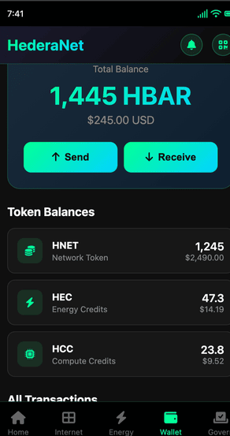
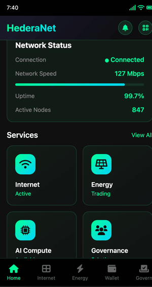
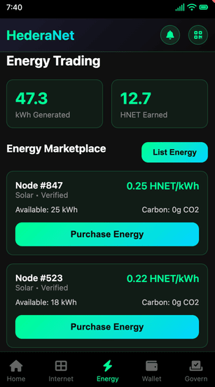
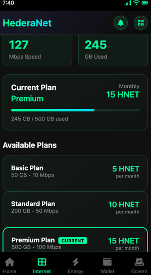
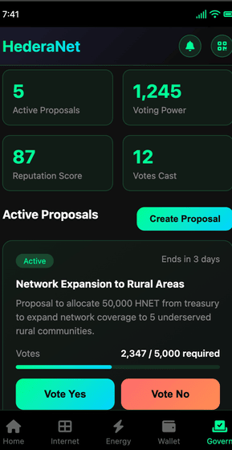

# HederaNet 🌐⚡

> **Empowering Communities Through Decentralized Infrastructure**

HederaNet transforms ordinary community members into infrastructure entrepreneurs through a DePIN (Decentralized Physical Infrastructure Network) that enables communities to own and operate their internet, energy, and compute services.

[](https://opensource.org/licenses/MIT)
[](https://reactnative.dev/)
[](https://hedera.com/)
[](https://www.typescriptlang.org/)

---

## 📋 Table of Contents

- [Overview](#overview)
- [Architecture](#architecture)
- [Features](#features)
- [Mobile App](#mobile-app)
- [Hedera Services](#hedera-services)
- [Getting Started](#getting-started)
- [Deployment](#deployment)
- [User Workflow](#user-workflow)
- [Smart Contracts](#smart-contracts)
- [API Reference](#api-reference)
- [License](#license)

---

## 🎯 Overview

HederaNet is a community-owned decentralized infrastructure network built on Hedera Hashgraph that enables:

- 🌐 **Community-Owned Internet**: Decentralized ISP services with transparent pricing
- ⚡ **Peer-to-Peer Energy Trading**: Buy and sell renewable energy directly
- 💻 **Distributed Compute**: Share unused computing power and earn rewards
- 🗳️ **Community Governance**: Democratic decision-making through token-weighted voting

### Key Statistics

- **Multi-Token Economy**: HNET (utility), HEC (energy credits), HCC (compute credits)
- **Smart Contract Automation**: Service payments, energy trading, governance
- **Immutable Logging**: Service quality, governance actions via HCS
- **Decentralized Storage**: Metadata, audit reports via HFS

---

## 🏗️ Architecture

```
┌─────────────────────────────────────────────────────────────┐
│                     HederaNet Mobile App                     │
│              (React Native - iOS & Android)                  │
└──────────────┬──────────────────────────────────────────────┘
               │
               ├── Wallet Integration (HashPack, Blade, MetaMask)
               │
               ├── Real-time Updates (HCS Subscriptions)
               │
               └── Smart Contract Interactions
                              │
┌─────────────────────────────┼─────────────────────────────────┐
│                    Hedera Hashgraph Layer                      │
├────────────────────────────────────────────────────────────────┤
│                                                                │
│  ┌──────────────┐  ┌──────────────┐  ┌──────────────┐       │
│  │   Hedera     │  │   Hedera     │  │   Hedera     │       │
│  │    Token     │  │  Consensus   │  │    Smart     │       │
│  │   Service    │  │   Service    │  │  Contract    │       │
│  │    (HTS)     │  │    (HCS)     │  │   Service    │       │
│  └──────────────┘  └──────────────┘  └──────────────┘       │
│         │                 │                  │                │
│  • HNET Token      • Service Quality  • Energy Trading       │
│  • HEC Credits     • Governance Log   • Service Payment      │
│  • HCC Credits     • Energy Trades    • Governance           │
│  • Reputation NFTs                                            │
│                                                                │
│  ┌──────────────┐                                             │
│  │   Hedera     │                                             │
│  │    File      │                                             │
│  │   Service    │                                             │
│  │    (HFS)     │                                             │
│  └──────────────┘                                             │
│         │                                                      │
│  • Metadata Storage                                           │
│  • Audit Reports                                              │
│  • Configuration Files                                        │
│                                                                │
└────────────────────────────────────────────────────────────────┘
```

---

## ✨ Features

### Users
- 💰 **Multi-Wallet Support**: Connect via HashPack, Blade, or MetaMask
- 📊 **Real-Time Balances**: Track HBAR, HNET, HEC, and HCC tokens
- 🔄 **Instant Transactions**: Send, receive, and swap tokens
- ⚡ **Energy Marketplace**: Buy/sell renewable energy with crypto
- 🌐 **Internet Services**: Subscribe to decentralized ISP plans
- 🗳️ **Governance**: Vote on proposals and shape the network
- 📱 **Mobile-First**: Native iOS and Android experience

### Technical
- 🔗 **Hedera SDK Integration**: Full TypeScript implementation
- 🎨 **React Native**: Cross-platform mobile development
- 🔐 **Type-Safe**: Complete TypeScript coverage
- 📦 **Redux Toolkit**: Centralized state management
- 🎯 **Smart Contracts**: Solidity contracts on Hedera
- 🧪 **Testing Ready**: Comprehensive test setup
- 🚀 **CI/CD**: GitHub Actions workflows included

---

## 📱 Mobile App

### Tech Stack

- **Framework**: React Native 0.73
- **Language**: TypeScript 5.3
- **State Management**: Redux Toolkit
- **Navigation**: React Navigation 6
- **Blockchain**: Hedera SDK (@hashgraph/sdk)
- **Styling**: React Native StyleSheet with custom theme
- **Icons**: React Native Vector Icons

### Project Structure

```
hederanet-mobile/
├── src/
│   ├── components/          # Reusable UI components
│   │   ├── common/         # Button, Card, Input, Modal
│   │   └── ...
│   ├── screens/            # Main app screens
│   │   ├── HomeScreen.tsx
│   │   ├── WalletScreen.tsx
│   │   ├── EnergyScreen.tsx
│   │   ├── GovernanceScreen.tsx
│   │   └── ServicesScreen.tsx
│   ├── navigation/         # Navigation setup
│   ├── services/           # Blockchain services
│   │   ├── hedera/        # HTS, HCS, HSCS, HFS
│   │   └── wallet/        # Wallet integration
│   ├── store/             # Redux state management
│   │   ├── slices/
│   │   └── types.ts
│   ├── theme/             # Colors, typography, spacing
│   └── utils/             # Helper functions
├── android/               # Android native code
├── ios/                   # iOS native code
└── package.json
```

### Installation

```bash
# Clone the repository
git clone https://github.com/monday436326/hederanet.git
cd hederanet

# Install dependencies
npm install

# iOS setup (macOS only)
cd ios && pod install && cd ..

# Configure environment
cp .env.example .env
# Edit .env with your Hedera credentials

# Run on Android
npm run android

# Run on iOS
npm run ios
```

### Environment Variables

```env
HEDERA_NETWORK=mainnet
HEDERA_MIRROR_NODE_URL=https://mainnet-public.mirrornode.hedera.com

# Token IDs (Testnet)
HNET_TOKEN_ID=0.0.7153593
HEC_TOKEN_ID=0.0.7153605
HCC_TOKEN_ID=0.0.7153651
REPUTATION_NFT_ID=0.0.7153666

# Contract IDs (Testnet)
ENERGY_TRADING_CONTRACT_ID=0.0.7153712
SERVICE_PAYMENT_CONTRACT_ID=0.0.7153764
GOVERNANCE_CONTRACT_ID=0.0.7153782

# Topic IDs
GOVERNANCE_TOPIC_ID=0.0.1006
SERVICE_QUALITY_TOPIC_ID=0.0.1005
ENERGY_TRADING_TOPIC_ID=0.0.1007

# Accounts
TREASURY_ACCOUNT_ID=0.0.1001
PLATFORM_ACCOUNT_ID=0.0.1012
```

---

## 🔗 Hedera Services

### 1. Hedera Token Service (HTS)

**Multi-Token Economy**

- **HNET Token**: Utility token with finite supply (1B tokens)
  - 8 decimals precision
  - Royalty fees on transfers
  - Vesting schedules for team/investors

- **HEC (Energy Credits)**: Minted on verified energy generation
  - 2 decimals (0.01 kWh precision)
  - Infinite supply
  - Metadata for energy provenance

- **HCC (Compute Credits)**: Issued for compute contribution
  - 6 decimals (micro-credit precision)
  - Infinite supply
  - Performance-based issuance

- **Reputation NFTs**: Soulbound achievement badges
  - Non-transferable
  - Revocable by governance
  - IPFS metadata storage

**Implementation**

```typescript
// Create HNET Token
npm run token:create-hnet

// Mint Energy Credits
npm run token:mint-hec -- --amount=100 --generator=0.0.123

// Issue Compute Credits
npm run token:mint-hcc -- --hours=10 --provider=0.0.456

// Mint Reputation Badge
npm run token:mint-badge -- --recipient=0.0.789 --tier=Gold
```

### 2. Hedera Consensus Service (HCS)

**Immutable Event Logging**

- **Service Quality Topic**: Provider metrics, uptime, ratings
- **Governance Topic**: Proposals, votes, executions
- **Energy Trading Topic**: Listings, purchases, deliveries

**Implementation**

```typescript
// Subscribe to governance events
npm run consensus:log-governance

// Log service quality
npm run consensus:log-quality

// Track energy trades
npm run consensus:log-trade
```

### 3. Hedera Smart Contract Service (HSCS)

**Automated Business Logic**

- **Service Payment Contract**: 85% provider, 10% platform, 5% community
- **Energy Trading Contract**: P2P marketplace with quality proofs
- **Governance Contract**: Token + reputation weighted voting

**Implementation**

```bash
# Deploy contracts
npm run sc:deploy-energy
npm run sc:deploy-service
npm run sc:deploy-governance

# Interact with contracts
# See detailed examples in smart-contracts/interactions/
```

### 4. Hedera File Service (HFS)

**Decentralized Storage**

- NFT metadata (JSON, images)
- Audit reports (immutable logs)
- Configuration files

**Implementation**

```bash
# Upload metadata
npm run file:upload-metadata

# Store audit report
npm run file:store-audit

# Retrieve file
npm run file:retrieve -- --fileId=0.0.2001
```

---

## 🚀 Getting Started

### Prerequisites

- Node.js >= 18.0.0
- React Native CLI
- Xcode (for iOS development)
- Android Studio (for Android development)
- Hedera Testnet/Mainnet account

### Quick Start

1. **Clone the repository**
```bash
git clone https://github.com/monday436326/hederanet.git
cd hederanet
```

2. **Install dependencies**
```bash
npm install
```

3. **Configure environment**
```bash
cp .env.example .env
# Edit .env with your credentials
```

4. **Run Hedera services (backend)**
```bash
# Create tokens
npm run token:create-hnet
npm run token:create-hec
npm run token:create-hcc

# Deploy smart contracts
npm run sc:deploy-energy
npm run sc:deploy-governance
npm run sc:deploy-service
```

5. **Run mobile app**
```bash
# iOS
npm run ios

# Android
npm run android
```

### Testing on Emulator

**Android Emulator**
```bash
# Start emulator
emulator -avd Pixel_5_API_33

# Run app
npm run android

# Test deep link
adb shell am start -W -a android.intent.action.VIEW \
  -d "hederanet://wallet-callback?accountId=0.0.123" \
  io.hederanet.mobile
```

**iOS Simulator**
```bash
# Start simulator
open -a Simulator

# Run app
npm run ios

# Test deep link
xcrun simctl openurl booted \
  "hederanet://wallet-callback?accountId=0.0.123"
```

---

## 📦 Deployment

### Build for Production

**Android**
```bash
cd android
./gradlew assembleRelease
# Output: android/app/build/outputs/apk/release/app-release.apk

# Build AAB for Play Store
./gradlew bundleRelease
# Output: android/app/build/outputs/bundle/release/app-release.aab
```

**iOS**
```bash
# Open Xcode
open ios/HederaNetMobile.xcworkspace

# Archive: Product > Archive
# Distribute: Window > Organizer > Distribute App
```

### App Store Submission

See [BUILD_AND_DEPLOY.md](./BUILD_AND_DEPLOY.md) for detailed instructions on:
- Code signing
- Store listings
- Screenshots requirements
- Review process
- CI/CD setup

---

## 👤 User Workflow

### 1. Wallet Connection

**Connect your Hedera wallet to access all features**



Users can connect using:
- **HashPack**: Official Hedera wallet with full features
- **Blade Wallet**: Fast and secure mobile wallet
- **MetaMask**: Via Hedera EVM compatibility

### 2. Home Dashboard

**View your balances, transactions, and quick actions**



Features:
- Total balance in HBAR and USD
- Token holdings (HNET, HEC, HCC)
- Recent transactions
- Quick actions: Send, Receive, Swap, Buy
- Network status indicators

### 3. Wallet Management

**Manage all your assets in one place**


Features:
- HBAR and token balances
- Complete transaction history
- Transaction status tracking
- QR code for receiving payments
- Transaction filtering and search

### 4. Energy Trading

**Buy and sell renewable energy on the marketplace**



Features:
- View active energy listings
- Create new energy listings
- Purchase energy from verified providers
- Track your energy generation stats
- View earnings from energy sales
- Carbon footprint tracking

### 5. Internet Services

**Subscribe to decentralized internet plans**



Features:
- Current plan overview
- Usage statistics
- Available plan tiers
- Upgrade/downgrade options
- Payment distribution transparency
- Real-time speed monitoring

### 6. Governance

**Participate in community decision-making**



Features:
- View active proposals
- Create new proposals (with reputation threshold)
- Cast votes (Yes/No/Abstain)
- Voting power display
- Reputation score
- Proposal history and results
- Vote tracking and notifications

---

## 📝 Smart Contracts

### Energy Trading Contract

```solidity
// Create energy listing
function createListing(
    uint256 amount,      // kWh * 100
    uint256 pricePerKwh, // HNET smallest unit
    uint256 duration,    // seconds
    bytes32 qualityProof // verification hash
) external returns (bytes32 listingId)

// Purchase energy
function purchaseEnergy(bytes32 listingId) external
```

### Service Payment Contract

```solidity
// Process service payment with automatic distribution
function processServicePayment(
    address provider,
    address consumer,
    address tokenAddress,
    uint256 amount,
    ServiceType serviceType
) external returns (int responseCode)
```

### Governance Contract

```solidity
// Create proposal
function createProposal(
    string memory title,
    string memory description,
    uint256 votingPeriod,
    uint256 quorum,
    uint256 threshold
) external returns (bytes32 proposalId)

// Cast vote
function castVote(
    bytes32 proposalId,
    VoteChoice choice
) external
```

---

## 🔌 API Reference

### Token Service

```typescript
// Get account balances
await hederaTokenService.getAccountBalances(accountId);

// Transfer tokens
await hederaTokenService.transferToken(tokenId, recipientId, amount, decimals);

// Transfer HBAR
await hederaTokenService.transferHbar(recipientId, amount);

// Associate token
await hederaTokenService.associateToken(tokenId);
```

### Smart Contract Service

```typescript
// Create energy listing
await smartContractService.createEnergyListing(
  energyAmount,
  pricePerKwh,
  durationSeconds,
  qualityProof
);

// Purchase energy
await smartContractService.purchaseEnergy(listingId);

// Create governance proposal
await smartContractService.createProposal(title, description, votingPeriodDays);

// Cast vote
await smartContractService.castVote(proposalId, choice);
```

### HCS Service

```typescript
// Submit governance action
await hcsService.submitGovernanceAction(action);

// Subscribe to governance events
await hcsService.subscribeToGovernance(callback);

// Submit energy trade
await hcsService.submitEnergyTrade(trade);

// Get recent trades
await hcsService.getRecentEnergyTrades(limit);
```

---

## 🧪 Testing

### Run Tests

```bash
# Unit tests
npm test

# Integration tests
npm run test:integration

# Coverage report
npm run test:coverage

# E2E tests (requires emulator)
npm run test:e2e
```

### Manual Testing Checklist

- [ ] Wallet connection (all 3 wallet types)
- [ ] Token transfers (HBAR, HNET, HEC, HCC)
- [ ] Energy listing creation
- [ ] Energy purchase
- [ ] Service subscription
- [ ] Proposal creation
- [ ] Vote casting
- [ ] Transaction history
- [ ] Deep link handling
- [ ] Offline mode

---


## 📄 License

This project is licensed under the MIT License - see the [LICENSE](LICENSE) file for details.

---

## 🙏 Acknowledgments

- [Hedera Hashgraph](https://hedera.com/) for the incredible DLT platform
- [React Native](https://reactnative.dev/) for the mobile framework
- HashPack, Blade, and MetaMask teams for wallet integration support

---

## 📞 Support

- **Documentation**: [docs.hederanet.io](https://hederanet.gitbook.io/hederanet-docs/)
- **Website**: https://hederanet.vercel.app
- **X(Twitter)**: [@HederaNet](https://x.com/hederanet)
- **Email**: support@hederanet.io
- **GitHub Issues**: [Report bugs](https://github.com/hederanet/hederanet/issues)

---

## 🗺️ Roadmap

### Q1 2026
- [x] Mobile app development (iOS & Android)
- [x] Hedera services integration
- [x] Smart contracts deployment
- [x] Testnet beta launch
- [ ] Mainnet launch
- [ ] Playstore / App Store Launch
- [ ] Decentralized Internet & Solar Energy Trading live in 5 countries

### Q2 2026
- [ ] Expansion to 15 African Countries
- [ ] IoT device support
- [ ] Cross-chain bridges
- [ ] DAO launch

### Q3 2026
- [ ] AI-powered network optimization
- [ ] Carbon credit marketplace
- [ ] Enterprise partnerships
- [ ] Global expansion

---

## 📊 Project Status

- **Version**: 1.0.0
- **Status**: Beta
- **Network**: Hedera Testnet
- **Last Updated**: January 2025

---

**Built with ❤️ by the HederaNet Community**

[Website](https://hederanet.vercel.app/) • [Documentation](https://docs.hederanet.io) • [Discord](https://discord.gg/hederanet)